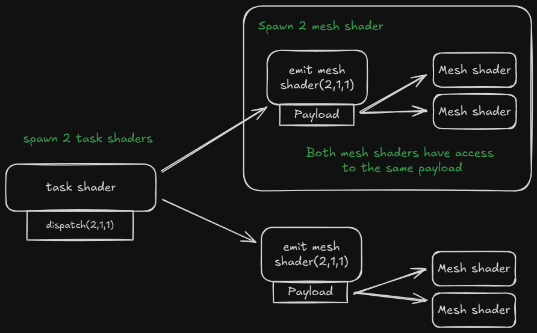

# Mesh shaders

For about 2 months I have worked on using mesh shaders. This is a new technique that improves and replaces the regular pipeline. It brings the compute pipeline to the graphics pipeline. One of the goals of the new pipeline is that you can render more geometry than before. I will be showing a vulkan implementation with glsl.


# Mesh shader pipeline
When using the mesh shader pipeline the vertex, geometry and tesselation stages are removed. They are replaced by the task shader and mesh shader. 

The new pipeline is.


::: info task shader
The task shader stage is optional. It works as a compute shader and can be programed to emit (or not) mesh shaders. There is a limit on how many mesh shaders can be spawned from one task shader. This depends on your gpu.
:::

::: info mesh shader
The mesh shader is required. It works also like a compute shader. It can produces vertices and triangles(primitives) to the rasterizer. There are limitations per gpu on how many vertices and triangles can be produced. DirectX limits it to 256. Most of the time you want to output about twice as many primitives as vertices [^1]
:::

To start here is a simple example mesh shader that only outputs 1 triangle. I will explain every keyword. Later I will start using meshlets to render full models.


```glsl
#version 460
#pragma shader_stage(mesh)
#extension GL_EXT_mesh_shader: enable

// We are only going to need 3 because we are exporting 1 triangle and 3 vertices each thread does 1 vertex.
layout (local_size_x = 3) in;

// set the count for gl_MeshVerticesEXT[] and gl_PrimitiveTriangleIndicesEXT[] arrays
layout (max_vertices = 3, max_primitives = 1) out;
layout (triangles) out;

// Export custom user data on the vertex. Same size as gl_MeshVerticesEXT
layout (location = 0) out vec3 vertex_color_out[];

void main()
{
    vec4 positions[3] = vec4[](
        vec4(0.0, -0.5, 0.0, 1.0),
        vec4(0.5, 0.5, 0.0, 1.0),
        vec4(-0.5, 0.5, 0.0, 1.0)
    );

    // Only one thread needs to set the MeshOutputs
    if (gl_LocalInvocationIndex == 0)
    {
        // At runtime we can say how many vertices we are really outputting
        SetMeshOutputsEXT(3, 1);
    }

    // Because we only have 1 triangle only 1 thread needs to export
    if (gl_LocalInvocationID.x < 1)
    {
        // Using the gl_LocalInvocationID a index for the output arrays.
        // Set the index that this triangle should use
        gl_PrimitiveTriangleIndicesEXT[gl_LocalInvocationID.x] = uvec3(0, 1, 2);
    }

    // Not needed but shows that we only export 3 vertices.
    if (gl_LocalInvocationID.x < 3)
    {
        // Gets the positions from the array and output it.
        gl_MeshVerticesEXT[gl_LocalInvocationID.x].gl_Position = positions[gl_LocalInvocationID.x];
        vertex_color_out[gl_LocalInvocationID.x] = vec3(1,0,0);
    }
}
```

::: info gl_PrimitiveTriangleIndicesEXT
This is a array of `uvec3` that holds the indices of the triangles.
:::

::: info gl_MeshVerticesEXT
An array with the gl_MeshPerVertexEXT struct only gl_Position is relevant for this example.
```glsl
struct gl_MeshPerVertexEXT {
    vec4 gl_Position;
    float gl_PointSize;
    float gl_ClipDistance[];
    float gl_CullDistance[];
}
```
:::

::: info layout (max_vertices = number, max_primitives = number) out;
This sets the size of the gl_PrimitiveTriangleIndicesEXT and gl_MeshVerticesEXT arrays. 
:::

::: info SetMeshOutputsEXT(vertex_count, triangle_count)
This is a function that will tell the rasterizer how many triangles and vertices there are in the arrays *gl_PrimitiveTriangleIndicesEXT* and *gl_MeshVerticesEXT*. So we don't have to fill up the full array.
:::

Creating the pipeline for the mesh shader is the extract same as the normal pipeline. But the `pVertexInputState` and `pInputAssemblyState` are ignored. 

```cpp
PipelineLayoutBuilder().build(m_context.device->get_device(), m_pipeline_layout_spheres);

GraphicsPipelineBuilder()
    .add_shader("shaders/example.mesh", VK_SHADER_STAGE_MESH_BIT_EXT)
    .add_shader("shaders/example.frag", VK_SHADER_STAGE_FRAGMENT_BIT)
    .set_color_format(std::array{ m_context.swapchain->get_swapchain_surface_format().format })
    .set_pipeline_layout(m_pipeline_layout_spheres)
    .build(m_context.device->get_device(), m_pipeline_spheres);
```

In vulkan to render this shader you need to call `vkCmdDrawMeshTasksEXT(cmd, 1, 1, 1)`

Now that we can render one triangle we want to render full models. Then we are going to need generate meshlets.


## Creating meshlets

To render a model with mesh shaders you need to generate meshlets they are small sections of the mesh. Generating these yourself meshlets can be tricky. I opted for using a library [meshoptimizer](https://github.com/zeux/meshoptimizer) it has a lot of features but it can also generate meshlets for you.

 
Meshoptimizer need to know how many vertices and triangles each meshlet maximum can have. These numbers need to be the same in the mesh shader.
::: info How many triangles?
- Nvidia recommends: max_vertices 64, max_triangles 126. [^2]
- Amd recommends:  max_vertices 64, max_triangles 128. [^3]
- Zeux (Creator of mesh-optimizer) recommends: max_vertices 64, max_triangles 96. [^4] 
:::

I am going to use Nvidia's recommendation.

Here is an example on how to generate meshlets using mesh optimizer. The `cone_weight` is for backface culling which I wont discuses but you can find resource [here](https://github.com/zeux/meshoptimizer#:~:text=if%20%28dot%28normalize%28cone%5Fapex%20%2D%20camera%5Fposition%29%2C%20cone%5Faxis%29%20%3E%3D%20cone%5Fcutoff%29%20reject%28%29%3B).
```cpp
// Magic values explained below
constexpr size_t max_vertices = 64;
constexpr size_t max_triangles = 126;
constexpr float  cone_weight = 0f; // If you want to do cone culling

// Ask meshoptimizer how many meshlets are going to be generated
size_t max_mesh_lets = meshopt_buildMeshletsBound(model.indices.size(), max_vertices, max_triangles);

// Output
std::vector<meshopt_Meshlet> meshlets(max_mesh_lets);
std::vector<uint32_t>        meshlet_vertices(max_mesh_lets * max_vertices);
std::vector<uint8_t>         meshlet_triangles(max_mesh_lets * max_triangles * 3);

size_t const meshlet_count = meshopt_buildMeshlets(
    meshlets.data(),
    meshlet_vertices.data(),
    meshlet_triangles.data(),
    model.indices.data(),
    model.indices.size(),
    model.vertices.data(),
    model.vertices.size(),
    sizeof(float) * 3,
    max_vertices,
    max_triangles,
    cone_weight);

// Crop the buffers because they are not fully filled
const meshopt_Meshlet& last = model.meshlets[meshlet_count - 1];
meshlet_vertices.resize(last.vertex_offset + last.vertex_count);
meshlet_triangles.resize(last.triangle_offset + last.triangle_count * 3);
meshlets.resize(meshlet_count);
```

Mesh optimizer exports multiple data structures:
::: info meshlets
This is a struct which holds the offset and count for both the vertex and triangle.\

:::

::: info meshlet_triangles
These are `uint8_t` which are 3 index together that form a triangle\

:::

::: info meshlet_vertices
These are `uint32_t` that hold index to the real vertex buffer. 
These are here because we don't want to duplicated vertices for each meshlet. As we assume that all vertices are right next to each other.

:::


## Rendering models with meshlets

We first need to bind all of buffers that we need for the draw call these are.
::: info Data buffers
- `Meshlet mesh_lets[]` Generated from meshoptimizer
- `Vertex vertices[]` All vertices from the model
- `uint vertex_indices[]` Generated from meshoptimizer
- `uint8_t triangle_indices[]` Generated from meshoptimizer
:::

To launch a mesh shader you call `vkCmdDrawMeshTasksEXT(cmd_buffer, meshlet_count, 1, 1)`.

Each meshlet gets its own workgroup. So countX is going to be the amount of meshlets. Then each invocation in that workgroup will output one triangle and one vertex.

Here is an example on how to to select the right meshlet and extract the vertices and triangles from it.

```glsl
// first get the meshlet via the workgroup id
Meshlet m = mesh_lets[gl_WorkGroupID.x];

// Set the vertex and triangle count from the meshlet
SetMeshOutputsEXT(m.vertex_count, m.triangle_count);

// Make sure we don't read out of bounds
if (gl_LocalInvocationID.x < m.triangle_count) {
    // Using the meshlets triangle_offset we get the base index in triangle_indices.
    // We add gl_LocalInvocationID then to get the right triangle offset
    uint triangle_index = m.triangle_offset + (gl_LocalInvocationID.x * 3);

    // The gl_PrimitiveTriangleIndicesEXT is a array with the size of local_size_x. 
    // So we use the gl_LocalInvocationID to index in the array.
    gl_PrimitiveTriangleIndicesEXT[gl_LocalInvocationID.x] = uvec3(
        triangle_indices[triangle_index],
        triangle_indices[triangle_index + 1],
        triangle_indices[triangle_index + 2]
    );
}

// We know the amount of vertices don't write and read out of bounds
if (gl_LocalInvocationID.x < m.vertex_count) {
    // Use the meshlet vertex_offset to get the right base then add the gl_LocalInvocationID for the right offset for this thread
    // This is why we need a vertex_indices we need get the index of the correct vertex of each meshlet. And because you don't want to duplicated vertices we use another array.
    uint vertex_index = vertex_indices[m.vertex_offset + gl_LocalInvocationID.x];

    // Matrix transformations
    vec4 location = sceneInfo.camera_projection_view * pc.model * vec4(vertices[vertex_index].position, 1.0);

    // gl_MeshVerticesEXT is max 64 big. We use the gl_LocalInvocationID to fill up the array by every thread.
    gl_MeshVerticesEXT[gl_LocalInvocationID.x].gl_Position = location;
}
```

::: details Full Mesh shader
```glsl
#version 460
#pragma shader_stage(mesh)
#extension GL_EXT_mesh_shader: enable
#extension GL_EXT_shader_8bit_storage: enable

#include "shared_structs.glsl"
#include "world_binds.glsl"

layout (local_size_x = 126, local_size_y = 1, local_size_z = 1) in;

layout (triangles) out;
layout (max_vertices = 64, max_primitives = 126) out;

layout (std430, set = 1, binding = 0) readonly buffer MeshletIn {
    Meshlet mesh_lets[];
};
layout (std140, set = 1, binding = 1) readonly buffer VertexIn {
    Vertex vertices[];
};
layout (std430, set = 1, binding = 2) readonly buffer VertexIndicesIn {
    uint vertex_indices[];
};
layout (std430, set = 1, binding = 3) readonly buffer TriangleIndicesIn {
    uint8_t triangle_indices[];
};
layout (push_constant) uniform PushConstant {
    mat4x4 model;
} pc;

layout (location = 0) out vec3 vertexColor[];

void main()
{
    Meshlet m = mesh_lets[gl_WorkGroupID.x];

    if (gl_LocalInvocationIndex == 0)
    {
        SetMeshOutputsEXT(m.vertex_count, m.triangle_count);
    }

    if (gl_LocalInvocationID.x < m.triangle_count) {
        gl_PrimitiveTriangleIndicesEXT[gl_LocalInvocationID.x] = uvec3(
        triangle_indices[m.triangle_offset + (gl_LocalInvocationID.x * 3)],
        triangle_indices[m.triangle_offset + (gl_LocalInvocationID.x * 3) + 1],
        triangle_indices[m.triangle_offset + (gl_LocalInvocationID.x * 3) + 2]
        );
    }

    if (gl_LocalInvocationID.x < m.vertex_count) {
        uint vertex_index = vertex_indices[m.vertex_offset + gl_LocalInvocationID.x];

        vec4 location = sceneInfo.camera_projection_view * pc.model * vec4(vertices[vertex_index].position, 1.0);

        gl_MeshVerticesEXT[gl_LocalInvocationID.x].gl_Position = location;

        uint mhash = hash(gl_WorkGroupID.x);
        vertexColor[gl_LocalInvocationID.x] = vec3(float(mhash & 255), float((mhash >> 8) & 255), float((mhash >> 16) & 255)) / 255.0;
    }
}
```
:::

# Task shader

The real fun starts when adding the task shader this will invoke the mesh shader and give it a payload.
One of the goals of this is to cull the meshlets. For now we are going to use the task shader to spawn mesh shaders.

Task shaders are dispatched the same way as mesh shaders. But with task shaders we can spawn some amount of mesh shaders.

In the image below. I am calling `vkCmdDrawMeshTasksEXT(cmd,2,1,1)` it will dispatch 2 groups of task shaders. Each group will produce its own payload. We use the threads of the workgroup to fill the payload\
Then each mesh shader that got invoked by the task shader gets access to the payload. This payload can be access by a entire dispatch.



### Task shader example

Every thread is going to fill the payload for one meshlet. We spawn 32 threads per workgroup. So we call `vkCmdDrawMeshTasksEXT(cmd, model.meshlet_count / 32 + 1, 1, 1)`.

```glsl
#define GROUP_SIZE 32
layout (local_size_x = GROUP_SIZE) in;

struct Payload {
    uint MeshletIndices[GROUP_SIZE];
};

// Payload for mesh shader declaration
taskPayloadSharedEXT Payload payload;

void main()
{
    // Every thread sets the meshlet id on which the mesh shader needs to work on.
    payload.MeshletIndices[gl_LocalInvocationID.x] = gl_GlobalInvocationID.x;

    // How many mesh shaders do we spawn?
    EmitMeshTasksEXT(GROUP_SIZE, 1, 1);
}
```

For the mesh shader I will use the same one as above but with some little tweaks.

```glsl
#define GROUP_SIZE 32 // [!code ++]
struct Payload { // [!code ++]
   uint MeshletIndices[GROUP_SIZE]; // [!code ++]
}; // [!code ++]

taskPayloadSharedEXT Payload payload; // [!code ++]

void main()
{
   uint meshletIndex = payload.MeshletIndices[gl_WorkGroupID.x]; // [!code ++]

    Meshlet m = Meshlets[gl_WorkGroupID.x]; // [!code --]
    Meshlet m = Meshlets[meshletIndex]; // [!code ++]

    SetMeshOutputsEXT(m.vertex_count, m.triangle_count);

    if (gl_LocalInvocationID.x < m.triangle_count) {
        // ...
    }

    if (gl_LocalInvocationID.x < m.vertex_count) {
       // ...
    }
}
```

Why is the GROUP_SIZE 32? nvidia gpu have a subgroupSize of 32. For culling I will use subgroups to create the payload data. You could maybe use 64 for amd


# Culling

Now for the real reason to be here the culling! 
The idea is to have spheres around every meshlet when that sphere is off screen it will not be invoked by the mesh shader.


To create these spheres we can use meshoptimizer.
```cpp
std::vector<glm::vec4> sphere_bounds;

for (const auto& meshlet : model.meshlets){
    meshopt_Bounds bounds = meshopt_computeMeshletBounds(
        &meshlet_vertices[meshlet.vertex_offset],
        &meshlet_triangles[meshlet.triangle_offset],
        meshlet.triangle_count,
        model.vertices.data(),
        model.vertices.size(),
        sizeof(float) * 3);
    sphere_bounds.emplace_back(bounds.center[0], bounds.center[1], bounds.center[2], bounds.radius);
}
```

On the gpu side we can index the sphere_bounds the same way we select the meshlet using the `gl_GlobalInvocationID`.

I won't go into details on how to do frustum culling. Go here if you want to know more: \
[6 planes culling learnopengl.com](https://learnopengl.com/Guest-Articles/2021/Scene/Frustum-Culling)

### How to use culling in the task shader.

We can access the correct sphere via `gl_GlobalInvocationID.x`.
After that we need to transform the sphere with the model matrix. This is not as simple because the sphere is xyz+size.\
Transform the sphere position and for the size use the largest and scale it by that to make sure that there sphere is around the entire meshlet.

```glsl
SphereBounds TransformSphere(SphereBounds sphere, mat4 matrix) {
    vec3 scale = vec3(
        length(matrix[0].xyz),
        length(matrix[1].xyz),
        length(matrix[2].xyz)
    );
    // Get the larged scale the model could be scaled to.
    float maxScale = max(max(scale.x, scale.y), scale.z);

    // transform the sphere with the matrix and scale the size.
    sphere.sphere_bounds = vec4(
        (matrix * vec4(sphere.sphere_bounds.xyz, 1.0f)).xyz,
        sphere.sphere_bounds.w * maxScale
    );

    return sphere;
}

```

Now we need to test if the sphere is visible in our camera. I am using [radar culling](https://web.archive.org/web/20240527070358/http://www.lighthouse3d.com/tutorials/view-frustum-culling/radar-approach-testing-points-ii/). 

Now here is the issue we want to create a payload where we create a array of meshlets ids that are visible right next to each other like a push_back but we are on the gpu and don't have that. You could use atomics for this to sync with the other invocations but this is slow.\
Instead we will use [subgroups](https://www.khronos.org/blog/vulkan-subgroup-tutorial)(wave intrinsics). 

```glsl
void main()
{
    // Get the sphere and transfrom it
    SphereBounds sphere = TransformSphere(sphere_bounds[gl_GlobalInvocationID.x], pc.model);

    // Do radar culling
    bool visible = IsVisible(sphere);

    // Create a subgroup ballot of all the results we got filling in the uvec4.
    uvec4 ballot = subgroupBallot(visible);

    // If the meshlet is not visible don't add it to this list of meshlets.
    if (visible) {
        // Count all bits that are 1 until you are at your own subgroup id.
        // Every invocation that is visible gets the result as: 0,1,2,3,4,5,6
        uint index = subgroupBallotExclusiveBitCount(ballot);

        // Use the index to write the payload data and give the meshlet id.
        payload.meshlet_indices[index] = gl_GlobalInvocationID.x;
    }

    // Get the total count of the visible meshlets
    uint visible_count = subgroupBallotBitCount(ballot);

    // Invoke visible_count many mesh shaders
    EmitMeshTasksEXT(visible_count, 1, 1);
}
```

To give a rundown of how subgroup group works.
We create a subgroupBallot which is a uvec4 where each bit is on invocation in the subgroup. NVIDIA gpu's spawn by every 32 invocations. The subgroup invocation id gets set to true or false. Then we can use `subgroupBallotExclusiveBitCount` to count up until this subgroup_id all the once that are true. Example:

|Invocation ID:|0|1|2|3|4
|-|-|-|-|-|-|
|Bit value|1|0|1|0|1|
|ExclusiveBitCount:|0|1|1|2|2

This is great because now we can index the payload array right after each other.

`subgroupBallotBitCount` Counts the total out which is the total count of meshlets that are visible.

::: details Full task shader
```glsl
#version 460
#pragma shader_stage(task)
#extension GL_EXT_mesh_shader: enable
#extension GL_KHR_shader_subgroup_ballot: enable
#extension GL_EXT_buffer_reference: require
#extension GL_EXT_shader_explicit_arithmetic_types_int64: require
#extension GL_EXT_shader_8bit_storage: require
#extension GL_EXT_shader_explicit_arithmetic_types: require
#extension GL_GOOGLE_include_directive: require

#define GROUP_SIZE 32
struct Payload {
    uint meshlet_indices[GROUP_SIZE];
    bool visable[GROUP_SIZE];
    uint model_index;
};

layout (local_size_x = GROUP_SIZE, local_size_y = 1, local_size_z = 1) in;

struct ConeBounds {
    vec4 sphere_bounds;
    vec4 cone_axis;
};

layout (std430, set = 1, binding = 4) readonly buffer SphereBoundsIn {
    ConeBounds SphereBounds[];
};

layout (push_constant) uniform PushConstant {
    mat4 model;
} pc;

taskPayloadSharedEXT Payload payload;

ConeBounds TransformCone(ConeBounds cone, mat4 matrix) {
    vec3 scale = vec3(
    length(matrix[0].xyz),
    length(matrix[1].xyz),
    length(matrix[2].xyz)
    );
    float maxScale = max(max(scale.x, scale.y), scale.z);

    cone.sphere_bounds = vec4(
    vec3(matrix * vec4(cone.sphere_bounds.xyz, 1.0f)),
    cone.sphere_bounds.w * maxScale
    );

    cone.cone_axis.xyz = mat3(matrix) * cone.cone_axis.xyz;

    return cone;
}

bool RaderCulling(ConeBounds cone) {
    bool result = true;
    vec3 ray = cone.sphere_bounds.xyz - sceneInfo.position;
    float z_projections = dot(ray, sceneInfo.rader_cull.camera_z);

    if (z_projections > sceneInfo.rader_cull.far_plane + cone.sphere_bounds.w || z_projections < sceneInfo.rader_cull.near_plane - cone.sphere_bounds.w) {
        return false;
    }

    float y_projections = dot(ray, sceneInfo.rader_cull.camera_y);
    float sphere_size_y = sceneInfo.rader_cull.sphere_factor_y * cone.sphere_bounds.w;
    float y_height = z_projections * sceneInfo.rader_cull.tang;
    if (y_projections > y_height + sphere_size_y || y_projections < -y_height - sphere_size_y) {
        return false;
    }

    float x_projection = dot(ray, sceneInfo.rader_cull.camera_x);
    float x_height = y_height * sceneInfo.rader_cull.ratio;
    float sphere_size_x = sceneInfo.rader_cull.sphere_factor_x * cone.sphere_bounds.w;
    if (x_projection > x_height + sphere_size_x || x_projection < -x_height - sphere_size_x) {
        return false;
    }

    return result;
}

bool IsVisible(ConeBounds cone) {
    if (!RaderCulling(cone)) {
        return false;
    }

    return true;
}

void main()
{
    ConeBounds cone = TransformCone(SphereBounds[gl_GlobalInvocationID.x], pc.model);

    bool visible = IsVisible(cone);

    uvec4 ballot = subgroupBallot(visible);
    if (visible) {
        uint index = subgroupBallotExclusiveBitCount(ballot);
        payload.meshlet_indices[index] = gl_GlobalInvocationID.x;
        payload.visable[index] = visible;
    }

    uint visible_count = subgroupBallotBitCount(ballot);

    EmitMeshTasksEXT(visible_count, 1, 1);
}
```
:::

And that's it to get simple culling working. You can start adding backface culling[^4]. 


# End notes

Now you know how to get started with mesh shaders. We implement mesh shaders with task shader and meshlets and some culling. If you want continue try adding [backface culling](https://github.com/zeux/meshoptimizer#:~:text=if%20%28dot%28normalize%28cone%5Fapex%20%2D%20camera%5Fposition%29%2C%20cone%5Faxis%29%20%3E%3D%20cone%5Fcutoff%29%20reject%28%29%3B) and [LOD](https://chaoticbob.github.io/2024/02/21/mesh-shading-part-5.html).


## other sources
- https://chaoticbob.github.io/2024/01/27/mesh-shading-part-4.html
- https://developer.nvidia.com/blog/introduction-turing-mesh-shaders/


## hlsl to glsl keywords
| hlsl | glsl | descriptions |
|------|------| -|
|SV_GroupID| gl_WorkGroupID| index of the global work group 
|SV_GroupThreadID| gl_LocalInvocationID| local work id within the work group 
|SV_DispatchThreadID| gl_GlobalInvocationID|  gl_WorkGroupID * gl_WorkGroupSize + gl_LocalInvocationID


# References

[^1]: https://gpuopen.com/learn/mesh_shaders/mesh_shaders-optimization_and_best_practices/
[^2]: https://developer.nvidia.com/blog/introduction-turing-mesh-shaders/#:~:text=code%2E-,We,triangles,-%2E
[^3]: https://gpuopen.com/download/GDC2024_Mesh_Shaders_in_AMD_RDNA_3_Architecture.pdf
[^4]: https://github.com/zeux/meshoptimizer