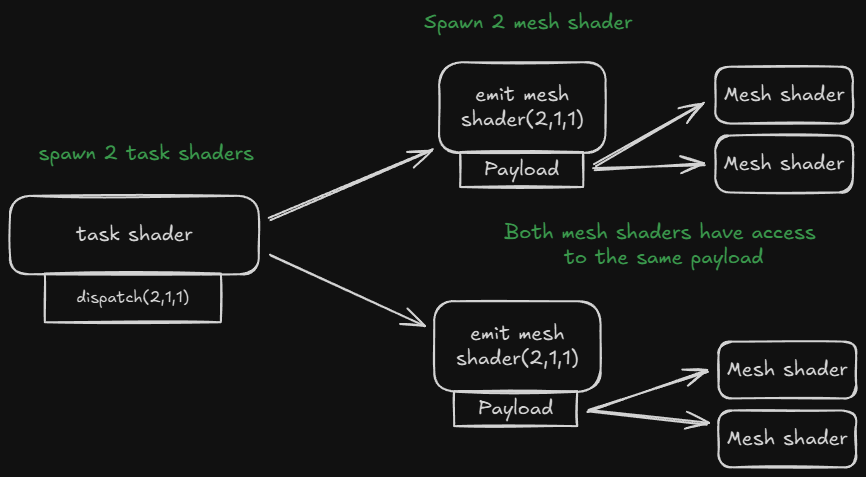
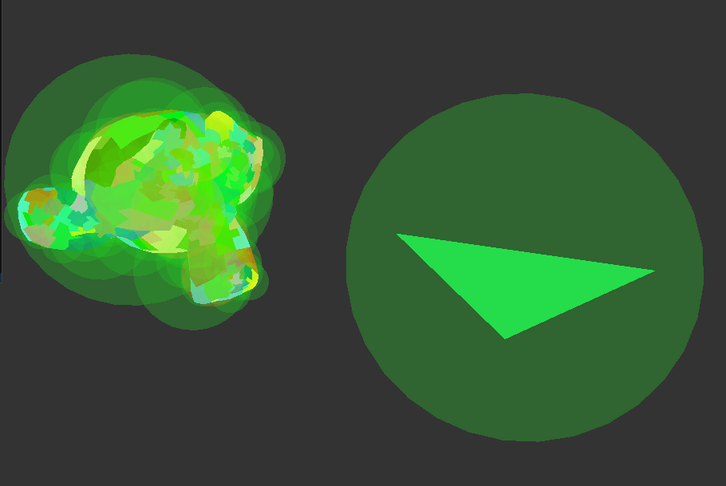

---
~
---

# Mesh shaders

For about 2 months I have worked on using mesh shaders. This is a new technieck that improves and replaces the normal pipeline. One of the goals of the new pipeline is that you can render more geometry then before. I will be showing a vulkan impletion with glsl.


# Mesh shaders

When using the mesh shader pipeline some stages are remove. No more vertex, geometry or tesselation shaders. Instead they are replaced by the task/amplification shader (task for vulkan, amplification for dx12). 
Mesh shaders are like a combined vertex/geometry shader the output data goes into the rasterizer and goes through the fragment shader like normal.


Mesh shader act like they are compute shaders. Here is a minimal example to output 1 triangle without any input.

```glsl
#version 460
#pragma shader_stage(mesh)
#extension GL_EXT_mesh_shader: enable

// Compute shader set thread group count
layout (local_size_x = 3) in;

// set the count for gl_MeshVerticesEXT[] and gl_PrimitiveTriangleIndicesEXT[] arrays
layout (max_vertices = 3, max_primitives = 1) out;
layout (triangles) out;

void main()
{
    vec4 positions[3] = vec4[](
    vec4(0.0, -0.5, 0.0, 1.0),
    vec4(0.5, 0.5, 0.0, 1.0),
    vec4(-0.5, 0.5, 0.0, 1.0)
    );

    if (gl_LocalInvocationIndex == 0)
    {
        // At runtime we can say how many vertices we are really outputting
        SetMeshOutputsEXT(3, 1);
    }

    if (gl_LocalInvocationID.x < 1)
    {
        // Set index for 
        gl_PrimitiveTriangleIndicesEXT[gl_LocalInvocationID.x] = uvec3(0, 1, 2);
    }

    if (gl_LocalInvocationID.x < 3)
    {
        gl_MeshVerticesEXT[gl_LocalInvocationID.x].gl_Position = positions[gl_LocalInvocationID.x];
    }
}
```

There are a couple new variables here. 

**gl_PrimitiveTriangleIndicesEXT**
This is a array of `uvec3` that holds the indices of the triangles your going to output.

**gl_MeshVerticesEXT**
An array with the gl_MeshPerVertexEXT struct only gl_Position is relevant for this example.
```glsl
struct gl_MeshPerVertexEXT {
    vec4 gl_Position;
    float gl_PointSize;
    float gl_ClipDistance[];
    float gl_CullDistance[];
}
```

**layout (max_vertices = number, max_primitives = number) out;**
This sets the size of the gl_PrimitiveTriangleIndicesEXT and gl_MeshVerticesEXT arrays. 

**SetMeshOutputsEXT(vertex_count, triangle_count)**
This is a function that will tell the rasterizer how many triangles and vertices there are in the arrays *gl_PrimitiveTriangleIndicesEXT* and *gl_MeshVerticesEXT*.


## Creating meshlets

To use mesh shader you need to generate meshlets they are small sections of the mesh. Generating these meshlets can be tricky luckly there are [other people](https://mastodon.gamedev.place/@zeux) who have already figured this out. 
[meshoptimizer](https://github.com/zeux/meshoptimizer) is a great library that can generate meshlets for you.

We need to decided how many vertices and triangles the mesh shader is going to output per meshlet online I have found these numbers.
- Nvidia recommends [^2] max_vertices 64, max_triangles 126. 
- Amd recommends [^1] max_vertices 64, max_triangles 128.
- Zeux (Creator of mesh-optimizer) recommends: [^3] max_vertices 64, max_triangles 96.

I am going to stick with Nvidia's recommendation.

Here is an example on how to generate meshlets using mesh optimizer.
```cpp
// Magic values explained below
constexpr size_t max_vertices = 64;
constexpr size_t max_triangles = 126;
constexpr float  cone_weight = 0f; // If you want to do cone culling

// Ask meshoptimizer how many meshlets are going to be generated
size_t max_mesh_lets = meshopt_buildMeshletsBound(model.indices.size(), max_vertices, max_triangles);

// Output
std::vector<meshopt_Meshlet> meshlets(max_mesh_lets);
std::vector<uint32_t>        meshlet_vertices(max_mesh_lets * max_vertices);
std::vector<uint8_t>         meshlet_triangles(max_mesh_lets * max_triangles * 3);

size_t const meshlet_count = meshopt_buildMeshlets(
    meshlets.data(),
    meshlet_vertices.data(),
    meshlet_triangles.data(),
    model.indices.data(),
    model.indices.size(),
    model.vertices.data(),
    model.vertices.size(),
    sizeof(float) * 3,
    max_vertices,
    max_triangles,
    cone_weight);

// Crop the buffers because they are not fully filled
const meshopt_Meshlet& last = model.meshlets[meshlet_count - 1];
meshlet_vertices.resize(last.vertex_offset + last.vertex_count);
meshlet_triangles.resize(last.triangle_offset + last.triangle_count * 3);
meshlets.resize(meshlet_count);
```

**meshlets**\
This is a struct which holds the offset and count for both the vertex and triangle.\


---

**meshlet_triangles**\
These are `uint8_t` which are 3 index together that form a triangle\
\

---

**meshlet_vertices**\
These are `uint32_t` that hold index to the real vertex buffer. 
These are here because if we don't we need to duplicated vertices for each meshlet. To prevent that we create a index buffer\


## Rendering models with meshlets

We first need to bind all of buffers that we need for the draw call these are.
- `Meshlet mesh_lets[]` Generated from meshoptimizer
- `Vertex vertices[]` All vertices from the model
- `uint vertex_indices[]` Generated from meshoptimizer
- `uint8_t triangle_indices[]` Generated from meshoptimizer
- `mat4 model_matrix` The model matrix
- `mat4 camera_projection_view` The camera project view matrix

To launch a mesh shader you call `vkCmdDrawMeshTasksEXT(cmd_buffer, countX, countY, countZ)`. This is a compute shader that we are launching.

Each meshlet gets its own workgroup. So countX is going to be the amount of meshlets.


Guide for people that use hlsl 
| hlsl | glsl | descriptions |
|------|------| -|
|SV_GroupID| gl_WorkGroupID| index of the global work group 
|SV_GroupThreadID| gl_LocalInvocationID| local work id within the work group 
|SV_DispatchThreadID| gl_GlobalInvocationID|  gl_WorkGroupID * gl_WorkGroupSize + gl_LocalInvocationID

Each meshlet will get its own workgroup. Then each thread in that workgroup will output one triangle and one vertex.

To get the right vertex and triangle here is how it works.

```glsl
// first get the meshlet via the workgroup id
Meshlet m = mesh_lets[gl_WorkGroupID.x];

// Set the vertex and triangle count from the meshlet
SetMeshOutputsEXT(m.vertex_count, m.triangle_count);

// Make sure we don't read out of bounds
if (gl_LocalInvocationID.x < m.triangle_count) {
    // Using the meshlets triangle_offset we get the base index in triangle_indices.
    // We add gl_LocalInvocationID then to get the right triangle offset
    uint triangle_index = m.triangle_offset + (gl_LocalInvocationID.x * 3);

    // The gl_PrimitiveTriangleIndicesEXT is a array with the size of local_size_x. 
    // So we use the gl_LocalInvocationID to index in the array.
    gl_PrimitiveTriangleIndicesEXT[gl_LocalInvocationID.x] = uvec3(
        triangle_indices[triangle_index],
        triangle_indices[triangle_index + 1],
        triangle_indices[triangle_index + 2]
    );
}

// We know the amount of vertices don't write and read out of bounds
if (gl_LocalInvocationID.x < m.vertex_count) {
    // Use the meshlet vertex_offset to get the right base then add the gl_LocalInvocationID for the right offset for this thread
    // This is why we need a vertex_indices we need get the index of the correct vertex of each meshlet. And because you don't want to duplicated vertices we use another array.
    uint vertex_index = vertex_indices[m.vertex_offset + gl_LocalInvocationID.x];

    // Matrix transformations
    vec4 location = sceneInfo.camera_projection_view * pc.model * vec4(vertices[vertex_index].position, 1.0);

    // gl_MeshVerticesEXT is max 64 big. We use the gl_LocalInvocationID to fill up the array by every thread.
    gl_MeshVerticesEXT[gl_LocalInvocationID.x].gl_Position = location;
}
```

<details>
  <summary>full glsl implementation</summary>
    ```glsl
    #version 460
    #pragma shader_stage(mesh)
    #extension GL_EXT_mesh_shader: enable
    #extension GL_EXT_shader_8bit_storage: enable

    #include "shared_structs.glsl"
    #include "world_binds.glsl"

    layout (local_size_x = 126, local_size_y = 1, local_size_z = 1) in;

    layout (triangles) out;
    layout (max_vertices = 64, max_primitives = 126) out;

    layout (std430, set = 1, binding = 0) readonly buffer MeshletIn {
        Meshlet mesh_lets[];
    };
    layout (std140, set = 1, binding = 1) readonly buffer VertexIn {
        Vertex vertices[];
    };
    layout (std430, set = 1, binding = 2) readonly buffer VertexIndicesIn {
        uint vertex_indices[];
    };
    layout (std430, set = 1, binding = 3) readonly buffer TriangleIndicesIn {
        uint8_t triangle_indices[];
    };
    layout (push_constant) uniform PushConstant {
        mat4x4 model;
    } pc;

    layout (location = 0) out vec3 vertexColor[];

    void main()
    {
        Meshlet m = mesh_lets[gl_WorkGroupID.x];

        if (gl_LocalInvocationIndex == 0)
        {
            SetMeshOutputsEXT(m.vertex_count, m.triangle_count);
        }

        if (gl_LocalInvocationID.x < m.triangle_count) {
            gl_PrimitiveTriangleIndicesEXT[gl_LocalInvocationID.x] = uvec3(
            triangle_indices[m.triangle_offset + (gl_LocalInvocationID.x * 3)],
            triangle_indices[m.triangle_offset + (gl_LocalInvocationID.x * 3) + 1],
            triangle_indices[m.triangle_offset + (gl_LocalInvocationID.x * 3) + 2]
            );
        }

        if (gl_LocalInvocationID.x < m.vertex_count) {
            uint vertex_index = vertex_indices[m.vertex_offset + gl_LocalInvocationID.x];

            vec4 location = sceneInfo.camera_projection_view * pc.model * vec4(vertices[vertex_index].position, 1.0);

            gl_MeshVerticesEXT[gl_LocalInvocationID.x].gl_Position = location;

            uint mhash = hash(gl_WorkGroupID.x);
            vertexColor[gl_LocalInvocationID.x] = vec3(float(mhash & 255), float((mhash >> 8) & 255), float((mhash >> 16) & 255)) / 255.0;
        }
    }
    ```
</details>

# Task shader

The real fun starts when adding the task shader this can invoke the mesh shader and give it some payload.
One of the goals of this is to frustum culling meshlets.

Task shaders are dispatched the same way as mesh shaders. But with task shaders we can spawn some amount of mesh shaders.

In the image below. I am calling `vkCmdDrawMeshTasksEXT(cmd,2,1,1)` it will invoke 2 thread groups of task shaders. Each group will produce its own payload. We use the threads of the group to fill the payload and make sure that all threads invoke the same amount of mesh shaders!\
Then each mesh shader that got invoked by the task shader gets access to the payload. This payload can be access by a entire thread group.



### glsl example

Every thread is going to fill the payload for one meshlet. We spawn 32 threads per workgroup. So we call `vkCmdDrawMeshTasksEXT(cmd, model.meshlet_count / 32 + 1, 1, 1)`.

```glsl
#define AS_GROUP_SIZE 32
layout (local_size_x = AS_GROUP_SIZE) in;

struct Payload {
    uint MeshletIndices[AS_GROUP_SIZE];
};

// Payload for mesh shader declaration
taskPayloadSharedEXT Payload payload;

void main()
{
    // Every thread sets the meshlet id on which the mesh shader needs to work on.
    payload.MeshletIndices[gl_LocalInvocationID.x] = gl_GlobalInvocationID.x;

    // How many mesh shaders do we spawn?
    EmitMeshTasksEXT(AS_GROUP_SIZE, 1, 1);
}
```

For the mesh shader I will use the same one as above but with some little tweaks.

```diff
+ #define AS_GROUP_SIZE 32
+ struct Payload {
+    uint MeshletIndices[AS_GROUP_SIZE];
+ };

+ taskPayloadSharedEXT Payload payload;

void main()
{
+   uint meshletIndex = payload.MeshletIndices[gl_WorkGroupID.x];

-   Meshlet m = Meshlets[gl_WorkGroupID.x];
+   Meshlet m = Meshlets[meshletIndex];

    SetMeshOutputsEXT(m.vertex_count, m.triangle_count);

    if (gl_LocalInvocationID.x < m.triangle_count) {
        // ...
    }

    if (gl_LocalInvocationID.x < m.vertex_count) {
       // ...
    }
}
```

Why use 32? NVIDIA gpu have a subgroupSize of 32. For culling I will use subgroups to create the payload data. For AMD you could use 64.


# Culling

Now for the real reason to be here the culling! 
The idea is to have spheres around every meshlet when that sphere is off screen it will not be invoked by the mesh shader.


To create these spheres we can use mesh optimizer.
```cpp
std::vector<glm::vec4> sphere_bounds;
for (const auto& meshlet : model.meshlets){
    meshopt_Bounds bounds = meshopt_computeMeshletBounds(
        &meshlet_vertices[meshlet.vertex_offset],
        &meshlet_triangles[meshlet.triangle_offset],
        meshlet.triangle_count,
        model.vertices.data(),
        model.vertices.size(),
        sizeof(float) * 3);
    sphere_bounds.emplace_back(bounds.center[0], bounds.center[1], bounds.center[2], bounds.radius);
}
```

On the gpu side we can index the sphere_bounds the same way we select the meshlet using the `gl_GlobalInvocationID`.

I wont go into details on how to do frustum culling. Go here if you want to know more: [6 planes culling learnopengl.com](https://learnopengl.com/Guest-Articles/2021/Scene/Frustum-Culling)

### How to use culling in the task shader.

We can access the correct sphere via `gl_GlobalInvocationID.x` because thats the same way we select the correct meshlet.

We need to transform and scale the matrix correctly.
```glsl
SphereBounds TransformSphere(SphereBounds sphere, mat4 matrix) {
    vec3 scale = vec3(
        length(matrix[0].xyz),
        length(matrix[1].xyz),
        length(matrix[2].xyz)
    );
    // Get the larged scale the model could be scaled to.
    float maxScale = max(max(scale.x, scale.y), scale.z);

    // transform the sphere with the matrix and scale the size.
    sphere.sphere_bounds = vec4(
        (matrix * vec4(sphere.sphere_bounds.xyz, 1.0f)).xyz,
        sphere.sphere_bounds.w * maxScale
    );

    return sphere;
}

```
To scale the spheres correctly we take the largest scale axis and scale the sphere as we don't have a way to scale the sphere non uniform. 

Now we need to test if the sphere is visible in our camera. I am using radar culling [link](https://web.archive.org/web/20240527070358/http://www.lighthouse3d.com/tutorials/view-frustum-culling/radar-approach-testing-points-ii/). 

Now here is the issue we want to create a payload where we create a array of meshlets id's that are visible right next to each other like a push_back but we are on the gpu and don't have that. You could use atomics for this to sync with the other invocations but this is slow.\
Instead we will use [subgroups](https://www.khronos.org/blog/vulkan-subgroup-tutorial)(wave intrinsics). 

```glsl
void main()
{
    SphereBounds sphere = TransformSphere(sphere_bounds[gl_GlobalInvocationID.x], pc.model);

    bool visible = IsVisible(sphere);

    uvec4 ballot = subgroupBallot(visible);
    if (visible) {
        uint index = subgroupBallotExclusiveBitCount(ballot);
        payload.meshlet_indices[index] = gl_GlobalInvocationID.x;
        payload.visible[index] = visible;
    }

    uint visible_count = subgroupBallotBitCount(ballot);

    EmitMeshTasksEXT(visible_count, 1, 1);
}
```

To give a rundown of how subgroup group works.
We create a subgroupBallot which is a uvec4 where each bit is on invocation in the subgroup. NVIDIA gpu's spawn by every 32 invocations. The subgroup invocation id gets set to true or false. Then we can use `subgroupBallotExclusiveBitCount` to count up until this subgroup_id all the once that are true. Example:

|Invocation ID:|0|1|2|3|4
|-|-|-|-|-|-|
|Bit value|1|0|1|0|1|
|ExclusiveBitCount:|0|1|1|2|2

This is great because now we can index the payload array right after each other.

`subgroupBallotBitCount` Counts the total out which is the total count of meshlets that are visable.


# References


[^1]: https://gpuopen.com/download/GDC2024_Mesh_Shaders_in_AMD_RDNA_3_Architecture.pdf
[^2]: https://developer.nvidia.com/blog/introduction-turing-mesh-shaders/#:~:text=code%2E-,We,triangles,-%2E
[^3]: https://github.com/zeux/meshoptimizer#:~:text=max%5Fvertices%2064%2C%20max%5Ftriangles%2096


